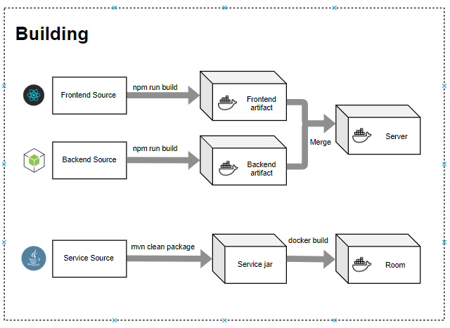
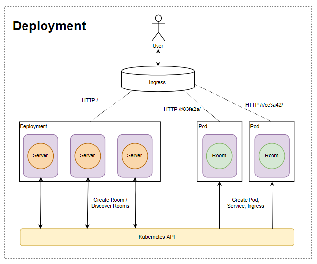

# Devops Homework

This repository contains multiple projects related to each other.
Each project is on it's own branch.

You can use [worktrees](https://git-scm.com/docs/git-worktree) to work on all of them using the same folder.

## About

The services together implement an application in which users can create rooms and then chat in them.

Users mainly interact with the server which consists of a frontend written in React and a backend written in Express. The backend creates rooms on demand using the K8s API. 

The room is written in Quarkus and it implements a websocket chat service. Quarkus allows building native images for the GraalVM which have a very small memory footprint. The room terminates on it's own if there are no clients connected. 

*Created by [Balazs Eszes](https://github.com/c4deszes) and [Bence Madarasz](https://github.com/msbence)*

[Presentation](https://docs.google.com/presentation/d/1_E6p5FQNrRJT9U7vqXMGranOfDUFm_E1N-12LgOmKBk/edit?usp=sharing)

## Building

CI is done using Jenkins, every project has it's own Jenkinsfile and Dockerfile. To setup the pipeline check the *infrastructure* branch.

An overview of the pipeline

## Deployment

At the end of the CI pipelines the image is pushed to Google Container Registry then the K8s deployment is updated.

The server has rolling updates enabled and the rooms created will always be of the latest image.

Cleanup: the Pod doesn't remove resources associated to it (Ingress and service) so there's a CronJob that executes a script to remove succeeded pods and their ingresses and services.