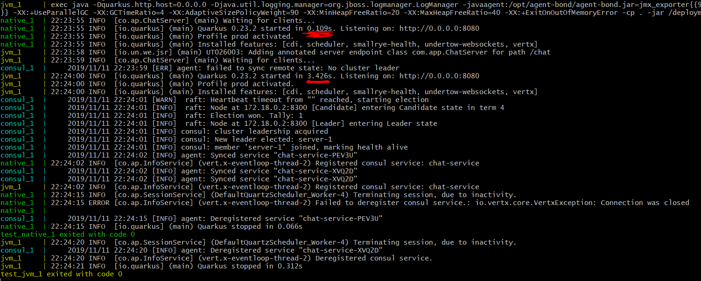
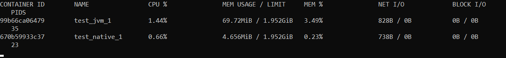

# Chat deployment

Deployment configuration and scripts

## Benchmark `/test`

Run the `start-compose.sh` script

It starts Consul with two permanent rooms, one using the JVM image and the other running the native image.

The containers can be accessed at the following addresses for further performance evaluation.

|Image |URL |
|---|---|
|JVM | [ws://localhost:3001/chat](ws://localhost:3001/chat) |
|Native |[ws://localhost:3002/chat](ws://localhost:3002/chat) |

### Results
**Startup time (as seen after running docker-compose)**

*[native: 0.109s, jvm: 3.426s]*

**Memory usage (as seen using `docker stats`)**

*[native: 4.6Mb, jvm: 69.7Mb]*

## Local test `/local`

Run the `start-compose.sh` script

It sets up the complete infrastructure with a single permanent room.

You can access the home by going to [localhost](http://127.0.0.1/)

## NGINX

The nginx.conf.ctmpl 

https://github.com/hashicorp/consul-template

consul-template \
  -template="/tmp/nginx.conf.ctmpl:/etc/nginx/conf.d/default.conf"

https://www.npmjs.com/package/dockerode

docker container exec <container> nginx -s reload